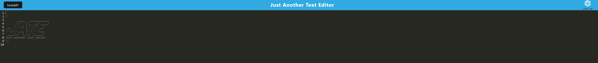

# Module 19 - PWA Text Editor

## Description

A progressive web application text editor deployed at heroku.

## Table of Contents 

* [Installation](#installation-instructions)

* [Usage](#usage-information)

* [License](#license)

* [Contributing](#contributing-guidelines)

* [Tests](#test-instructions)

* [Questions](#questions)

## Installation Instructions

Please follow these steps when running this application.   1. git clone the repository to your local machine.  2. In terminal, CD into the application's folder.  3. Type and enter 'npm install' to install the dependencies.  4. CD into the server folder and client folder and type and enter 'npm install' to install those dependencies.  5. Back in the application folder, type and enter 'npm run start' to run the application, the application will be live on your localhost.

## Usage Information

This project should be used as an example of how PWA applications operate, the code required for PWA applications to run and to test if the PWA application can be installed on your local machine / accessed without wifi.

Sample:

## License

MIT: Permissive free license software. Please visit https://opensource.org/licenses/MIT for more information.
  
## Contributing Guidelines

Flipper5001 was the sole contributer for this project. If you wish to make any contributions, please refer to the questions section for our contact information.

## Test Instructions

The original source code for the application was provied, this module was about using code to make the application a PWA workable offline.
## Questions

Other works can be found on https://github.com/Flipper5001.

If you have any questions or queries, please contact the following email address and we will get back to you as soon as possible.  
placeholder@gmail.com

## Link to site
https://m19-pwa-jate.herokuapp.com/

